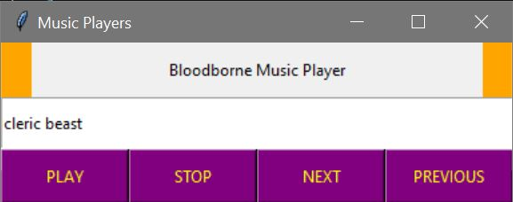

  
  <h1 align="center">Bloodborne Music Player</h1>
  

    This is a music player for Bloodborne soundtracks.

<!-- ABOUT THE PROJECT -->
## About The Project

### Built With

* Python
* Python - PyGame

<!-- GETTING STARTED -->
## The Process and What I have learned

### The Process

First, I created the interface using Tkinter and tried to get one music played. After I made the music to play, I worked on adding another music. Then, I needed to make it stop when I press the STOP button. Or pause the music when I press the PAUSE button. Lastly, I made the music to play again once the music ended.

  

### Lesson Learned

Using a PyGame to play music was tricky. For some reason, the music was not playing at all, so I had to research for hours and ask questions to fix the problem. I wish I could have used a different library, but I could not find a better alternative to PyGame at the time. Maybe the next time, I will try other libraries. Also, changing a button when the music is playing was challenging. 

  

I learned that understanding the problem is very important. For example, if I don't understand the error, I will never be able to fix the error. 
  

